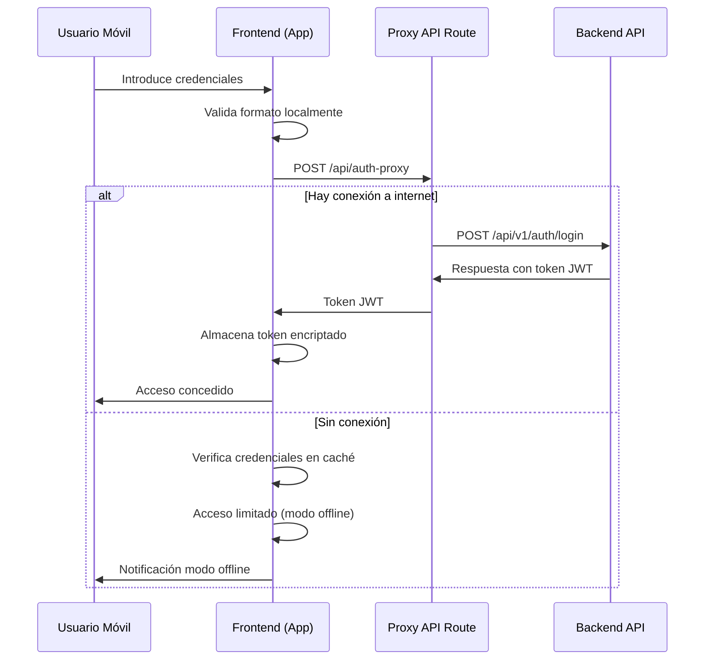

# AUTENTICACIÓN

La autenticación del sistema se basa en JWT (JSON Web Tokens) para mantener sesiones de usuario seguras. Se ha implementado un sistema robusto que considera los requisitos de uso en entornos rurales con conectividad limitada.

## 1. Usuarios y Roles

### Roles Disponibles

  - **Admin**: Acceso completo al sistema
  - **Usuario**: Acceso restringido según permisos
  - **Invitado**: Solo visualización de datos públicos

### Usuario Predeterminado

El sistema cuenta con un usuario administrador preconfigurado:

```plaintext
username: admin
password: admin123
```

## 2. Implementación de Autenticación

### Backend (FastAPI)

```python
from datetime import datetime, timedelta
from typing import Optional

from fastapi import Depends, FastAPI, HTTPException, status
from fastapi.security import OAuth2PasswordBearer, OAuth2PasswordRequestForm
from jose import JWTError, jwt
from passlib.context import CryptContext
from pydantic import BaseModel

# Configuración de seguridad
SECRET_KEY = "clave_secreta_change_in_production"
ALGORITHM = "HS256"
ACCESS_TOKEN_EXPIRE_MINUTES = 30

# Utilidades para password
pwd_context = CryptContext(schemes=["bcrypt"], deprecated="auto")
oauth2_scheme = OAuth2PasswordBearer(tokenUrl="api/v1/auth/login")

# Función para verificar password
def verify_password(plain_password, hashed_password):
    return pwd_context.verify(plain_password, hashed_password)

# Función para generar token
def create_access_token(data: dict, expires_delta: Optional[timedelta] = None):
    to_encode = data.copy()
    expire = datetime.utcnow() + (expires_delta or timedelta(minutes=15))
    to_encode.update({"exp": expire})
    encoded_jwt = jwt.encode(to_encode, SECRET_KEY, algorithm=ALGORITHM)
    return encoded_jwt
```

### Frontend (Next.js/Astro)

```typescript
// authService.ts
import axios from 'axios';

interface LoginResponse {
  access_token: string;
  token_type: string;
}

export async function login(username: string, password: string): Promise<LoginResponse> {
  try {
    const response = await fetch('/api/auth-proxy', {
      method: 'POST',
      headers: {
        'Content-Type': 'application/json',
      },
      body: JSON.stringify({ username, password }),
    });
    
    if (!response.ok) {
      const errorData = await response.json();
      throw new Error(errorData.detail || 'Error de autenticación');
    }
    
    return await response.json();
  } catch (error) {
    console.error('Error en login:', error);
    throw error;
  }
}

export function storeToken(token: string): void {
  localStorage.setItem('auth_token', token);
}

export function getToken(): string | null {
  return localStorage.getItem('auth_token');
}

export function removeToken(): void {
  localStorage.removeItem('auth_token');
}

export function isAuthenticated(): boolean {
  return !!getToken();
}
```

## 3. Proceso de Login

### Endpoint de Login

```python
# routes/auth.py
@router.post("/login", response_model=Token)
async def login_for_access_token(form_data: OAuth2PasswordRequestForm = Depends()):
    user = authenticate_user(form_data.username, form_data.password)
    if not user:
        raise HTTPException(
            status_code=status.HTTP_401_UNAUTHORIZED,
            detail="Credenciales incorrectas",
            headers={"WWW-Authenticate": "Bearer"},
        )
    access_token_expires = timedelta(minutes=ACCESS_TOKEN_EXPIRE_MINUTES)
    access_token = create_access_token(
        data={"sub": user.username}, expires_delta=access_token_expires
    )
    return {"access_token": access_token, "token_type": "bearer"}
```

### Flujo de Autenticación

1. Usuario envía credenciales al frontend
2. Frontend envía solicitud al proxy de API
3. Proxy de API reenvía la solicitud al backend
4. Backend verifica credenciales y genera token JWT
5. Token devuelto a frontend a través del proxy
6. Frontend almacena token para peticiones futuras

## 4. Protección de Rutas

### Backend (Middleware)

```python
# dependencies.py
async def get_current_user(token: str = Depends(oauth2_scheme)):
    credentials_exception = HTTPException(
        status_code=status.HTTP_401_UNAUTHORIZED,
        detail="No se pudieron validar las credenciales",
        headers={"WWW-Authenticate": "Bearer"},
    )
    try:
        payload = jwt.decode(token, SECRET_KEY, algorithms=[ALGORITHM])
        username: str = payload.get("sub")
        if username is None:
            raise credentials_exception
    except JWTError:
        raise credentials_exception
    user = get_user(username)
    if user is None:
        raise credentials_exception
    return user

async def get_current_active_user(current_user = Depends(get_current_user)):
    if current_user.disabled:
        raise HTTPException(status_code=400, detail="Usuario inactivo")
    return current_user
```

### Frontend (Protección de Rutas)

```typescript
// AuthGuard.tsx
import { useEffect, useState } from 'react';
import { useRouter } from 'next/router';
import { isAuthenticated } from '../services/authService';

export function AuthGuard({ children }) {
  const router = useRouter();
  const [authorized, setAuthorized] = useState(false);

  useEffect(() => {
    const checkAuth = () => {
      if (!isAuthenticated() && router.pathname !== '/login') {
        router.push('/login');
      } else {
        setAuthorized(true);
      }
    };

    checkAuth();
  }, [router]);

  return authorized ? children : null;
}
```

## 5. Renovación de Tokens

Pendiente implementación de refresh tokens para:

- Prolongar sesiones sin requerir re-login
- Mejorar experiencia de usuario en sesiones largas
- Incrementar seguridad rotando tokens de acceso

## 6. Seguridad

### Consideraciones Implementadas

- Tokens JWT con caducidad
- Contraseñas hasheadas con bcrypt
- HTTP-only cookies para almacenamiento seguro
- Validación de roles para acciones críticas

### Pendientes

- Two-factor authentication
- Logging de intentos fallidos de acceso
- Políticas de contraseñas seguras
- Bloqueo temporal tras múltiples intentos fallidos

## 7. API Proxy para Autenticación

```javascript
// api/auth-proxy.js
export default async function handler(req, res) {
  if (req.method !== 'POST') {
    return res.status(405).json({ message: 'Method not allowed' });
  }

  try {
    const response = await fetch(`${process.env.BACKEND_URL}/api/v1/auth/login`, {
      method: 'POST',
      headers: {
        'Content-Type': 'application/x-www-form-urlencoded'
      },
      body: new URLSearchParams(req.body)
    });

    const data = await response.json();
    return res.status(response.status).json(data);
  } catch (error) {
    return res.status(500).json({ message: 'Error en autenticación' });
  }
}
```

## 8. ACTUALIZACIÓN (14/Marzo/2025): Arquitectura de Autenticación para Acceso Móvil en Campo

### Contexto de Uso Móvil

Esta actualización aborda las necesidades específicas de los usuarios ganaderos que utilizan el sistema en condiciones de campo con dispositivos móviles y conectividad intermitente.

### Desafíos de Autenticación en Entornos Rurales

- **Conectividad limitada**: Los usuarios pueden tener acceso intermitente a internet
- **Sesiones de larga duración**: Necesidad de mantener la autenticación durante periodos prolongados
- **Seguridad del dispositivo**: Riesgo de acceso no autorizado si el dispositivo se pierde o es robado
- **Eficiencia energética**: Minimizar el consumo de batería durante el proceso de autenticación

### Arquitectura de Proxy de Autenticación

Para resolver los problemas de CORS y optimizar el rendimiento en dispositivos móviles, hemos implementado una arquitectura de proxy mediante API Routes:

```javascript
// frontend/src/pages/api/auth-proxy.js
export default async function handler(req, res) {
  if (req.method !== 'POST') {
    return res.status(405).json({ message: 'Method not allowed' });
  }

  const authEndpoint = process.env.BACKEND_URL + '/api/v1/auth/login';
  
  try {
    const response = await fetch(authEndpoint, {
      method: 'POST',
      headers: {
        'Content-Type': 'application/x-www-form-urlencoded',
      },
      body: req.body,
    });

    const data = await response.json();

    if (!response.ok) {
      return res.status(response.status).json(data);
    }

    return res.status(200).json(data);
  } catch (error) {
    return res.status(500).json({ message: 'Error en la autenticación: ' + error.message });
  }
}
```

Esta solución ofrece múltiples ventajas para el contexto móvil:

1. **Eliminación de problemas CORS**: Fundamental para dispositivos móviles que pueden cambiar de red
2. **Capa de abstracción**: El frontend móvil no necesita conocer detalles de implementación del backend
3. **Optimización de tráfico**: Permite filtrar y comprimir respuestas para reducir consumo de datos móviles
4. **Homogeneización de errores**: Respuestas de error consistentes independientemente de la calidad de conexión

### Estrategia de Tokens para Uso Móvil

Hemos ajustado la configuración de tokens JWT para el contexto móvil:

```python
# Configuración móvil específica
MOBILE_ACCESS_TOKEN_EXPIRE_MINUTES = 1440  # 24 horas para sesiones en campo
REFRESH_TOKEN_EXPIRE_DAYS = 30  # 30 días para minimizar reautenticaciones
```

### Manejo de Sesiones Offline

Para situaciones donde no hay conectividad, implementamos:

1. **Almacenamiento seguro del token**: Utilización de almacenamiento encriptado para tokens
2. **Revalidación periódica**: Intentos de refresco automático cuando se recupera la conexión
3. **Políticas de acceso offline**: Definición clara de qué funcionalidades están disponibles sin conexión

### Consideraciones de Seguridad para Uso en Campo

- **Bloqueo automático**: Cierre de sesión tras periodos de inactividad configurables
- **Autenticación biométrica**: Uso opcional de huella dactilar/facial para reapertura de sesión
- **Encriptación local**: Datos sensibles almacenados con encriptación AES-256
- **Límite de intentos**: Restricción de intentos fallidos de autenticación

### Flujo de Autenticación Optimizado para Móviles



Esta actualización refuerza nuestra estrategia de autenticación para que sea robusta en condiciones de campo, con consideraciones específicas para la conectividad limitada y los patrones de uso móvil de los ganaderos.