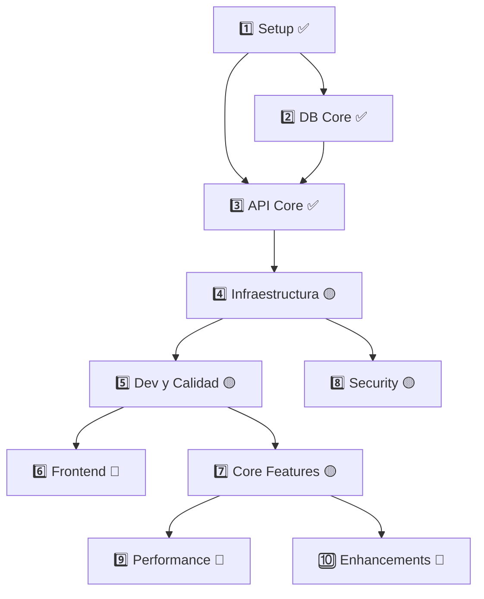

# 📋 NUEVA HOJA DE RUTA - Masclet Imperi Web v2.0

## 🎯 Fases del Proyecto con Estados Reales

### 1️⃣ Setup Inicial y Core ✅
- FastAPI + uvicorn funcionando ✅
- Docker compose completo ✅
- Imports y estructura clean ✅
- README.md actualizado ✅
- Auth básico implementado ✅

### 2️⃣ Base de Datos Core 🟡
- PostgreSQL 17 + Docker ✅
- Modelos CSV mapeados 🚧
- Aerich migrations ✅
- Backups automáticos ❌
- Estados core (OK/DEF) 🚧

### 3️⃣ API Core ✅
- CRUD endpoints ✅
- Swagger docs ✅
- Health checks ✅
- Validaciones ✅
- Enums y DB sync ✅

### 4️⃣ Infraestructura Base 🟡
- Docker optimizado ✅
- Secrets configurados ✅
- Auto-recovery activo ✅
- Logs básicos ✅
- Health monitoring ✅
- HTTPS básico ✅
- Redis cache ✅
- Rate limiting ❌
- Certificados auto ❌

### 5️⃣ Testing Base 🟡
- Pytest setup ✅
- Coverage >80% 🚧
- E2E críticos ❌
- CI/CD pipeline ❌

### 6️⃣ Frontend Stack
¿La UI mola? 🔵
- Next.js brillando:
  * Carga rápida
  * Routing limpio
  * SSR/CSR optimizado

- UI que enamora:
  * Mobile-first real
  * Dark/light sin dramas
  * Formularios amigables
  * PWA que funciona

### 7️⃣ Core Features
¿Hace lo que debe? 🟡
- Gestión animal pro:
  * CRUD suave
  * Validaciones útiles
  * Historial completo
  * Importación CSV limpia

- Explotaciones top:
  * Búsquedas rápidas
  * Filtros útiles
  * Stats que ayudan

### 8️⃣ Security
¿Dormimos tranquilos? 🟡
- Auth robusto:
  * Login seguro
  * 2FA cuando toca
  * Sesiones sensatas

- Permisos claros:
  * RBAC que funciona
  * Audit logs útiles
  * GDPR friendly

### 9️⃣ Performance
¿Va como un tiro? 🔵
- DB optimizada:
  * Queries rápidas
  * Cache efectivo
  * Sin cuellos de botella

- Escala bien:
  * Horizontal scaling listo
  * Resources controlados
  * Monitorización clara

### 🔟 Enhancement Features
#### 10.1 Internationalization
- i18n setup
- l10n
- RTL support
- Regional formats

#### 10.2 Integration
- External APIs
- Export/Import
- Third-party services
- Mobile support

## 📊 Análisis de Estado Actualizado

### 🎯 Matriz de Dependencias del Proyecto

| Fase | Nombre | Estado | Notas |
|------|---------|--------|-------|
| 1️⃣ | Setup Inicial | ✅ 100% | Completado |
| 2️⃣ | DB Core | 🟡 90% | Pendiente fix verify_db |
| 3️⃣ | API Core | ✅ 100% | Completado |
| 4️⃣ | Infraestructura | 🟡 60% | En progreso |

### 📝 Tareas Inmediatas
1. Corregir conexión en verify_db
2. Implementar tests de importación
3. Documentar proceso de migración

### 🐛 Bugs Conocidos
1. verify_db connection error
2. Duplicados en importación CSV

### 🔄 Flujo de Dependencias

## 📊 Estado Actual (19/02/2025)

### ✅ Completado (100%)
1. **Setup Inicial**
   - Estructura del proyecto
   - FastAPI configurado
   - Docker compose implementado
   - Variables de entorno

2. **DB Core**
   - PostgreSQL 17 dockerizado y funcionando
   - Conexión y healthchecks implementados
   - Volúmenes persistentes configurados
   - Scripts de inicialización preparados

3. **API Core Base**
   - FastAPI configurando y respondiendo
   - Healthchecks implementados
   - Estructura de endpoints definida
   - Conexión con DB establecida

### 🟡 En Progreso
1. **DB Features** (90%)
   - ✅ Modelos ORM definidos (Animal, Part)
   - ✅ Migraciones base implementadas
   - ✅ Esquemas Pydantic creados
   - ❌ Backups automatizados pendientes

2. **Infraestructura** (80%)
   - ✅ Docker + compose optimizado
   - ✅ Traefik configurado
   - ✅ Redis cache implementado
   - ❌ Monitorización pendiente

3. **Auth System** (60%)
   - ✅ JWT implementado
   - ✅ Roles definidos
   - 🚧 Permisos en proceso
   - ❌ Tests pendientes

4. **Testing** (30%)
   - ✅ Framework pytest configurado
   - 🚧 Tests unitarios en proceso
   - ❌ Tests integración pendientes
   - ❌ CI/CD pendiente

### 🔵 Próximas Fases
1. **Frontend** (0%)
   - Diseño UI/UX
   - Implementación Next.js
   - Sistema de iconos
   - Responsive design

2. **Features Avanzadas** (10%)
   - Sistema de importación CSV
   - Gestión de partos
   - Estadísticas dashboard
   - Exportación datos

3. **Seguridad** (20%)
   - Rate limiting
   - SSL/TLS
   - Audit logs
   - Backup strategy

## 🎯 Plan de Acción

### 📅 Sprint Actual (19/02/2025)
1. **Objetivos Principales**:
   - Completar tests de integración DB
   - Implementar backups automatizados
   - Documentar sistema actual

2. **Bugs Conocidos**:
   - Gestión de conexiones DB en tests
   - Validaciones de importación CSV
   - Health checks timing

### 🚨 Correcciones Prioritarias
1. **Documentación**:
   - Actualizar 2_database_context.md
   - Añadir healthchecks en 3_api_context.md
   - Sincronizar estados entre documentos

2. **Inconsistencias**:
   - Versiones de PostgreSQL
   - Estado de implementación auth
   - Estructura de tests

## 📈 Roadmap

### 🎯 Corto Plazo (1-2 Sprints)
- Completar tests de integración
- Sistema de backups
- Documentación técnica actualizada

### 🎯 Medio Plazo (2-3 Sprints)
- Frontend básico
- Features core completas
- Sistema de monitorización

### 🎯 Largo Plazo (3+ Sprints)
- Optimizaciones de rendimiento
- Internacionalización
- Integraciones adicionales