# Análisis Exhaustivo del Dashboard de Masclet Imperi

## Diagrama de Flujo y Relaciones

```mermaid
graph TD
    %% Nodo central - Dashboard principal
    Dashboard["Dashboard.tsx<br/>(Orquestador Principal)"] 
  
    %% Definiciones de tipos
    Types["dashboard.ts<br/>(Definiciones de Tipos)"]
  
    %% Componentes de secciones
    ResumenGeneral["ResumenGeneralSection.tsx<br/>(Resumen de Animales)"]
    PartosSection["PartosSection.tsx<br/>(Análisis de Partos)"]
    ExplotacionesSection["ExplotacionesSection.tsx<br/>(Análisis de Explotaciones)"]
  
    %% Componentes UI
    UIComponents["UIComponents.tsx<br/>(Componentes de UI)"]
    ChartComponents["ChartComponents.tsx<br/>(Componentes de Gráficos)"]
  
    %% Componentes auxiliares
    ActivityFeed["ActivityFeed.tsx<br/>(Feed de Actividad)"]
    DashboardFilters["DashboardFilters.tsx<br/>(Filtros)"]
    LoadingIndicator["LoadingIndicator.tsx<br/>(Indicador de Carga)"]
  
    %% Estilos y servicios
    Styles["dashboardStyles.css<br/>(Estilos)"]
    ApiService["apiService.ts<br/>(Servicios API)"]
  
    %% Hooks personalizados
    useDashboardData["useDashboardData.ts<br/>(Hook de Datos)"]
    useDarkMode["useDarkMode.ts<br/>(Hook de Modo Oscuro)"]
  
    %% Backend
    BackendAPI["API del Backend<br/>(Endpoints)"]
    VerificadorContadores["verificar_contadores.py<br/>(Lógica de Negocio)"]
  
    %% Relaciones principales
    Dashboard --> Types
    Dashboard --> ResumenGeneral
    Dashboard --> PartosSection
    Dashboard --> ExplotacionesSection
    Dashboard --> DashboardFilters
    Dashboard --> ActivityFeed
    Dashboard --> Styles
    Dashboard --> ApiService
    Dashboard --> useDashboardData
    Dashboard --> useDarkMode
  
    %% Relación con backend
    Dashboard --> BackendAPI
    BackendAPI -.-> VerificadorContadores
  
    %% Relaciones de componentes de sección
    ResumenGeneral --> Types
    ResumenGeneral --> UIComponents
    ResumenGeneral --> ChartComponents
    PartosSection --> Types
    PartosSection --> UIComponents
    PartosSection --> ChartComponents
    ExplotacionesSection --> Types
    ExplotacionesSection --> UIComponents
    ExplotacionesSection --> ChartComponents
  
    %% Relaciones de componentes auxiliares
    DashboardFilters --> UIComponents
    ActivityFeed --> UIComponents
    ActivityFeed --> LoadingIndicator
  
    %% Estilo de los nodos
    classDef central fill:#f9d71c,stroke:#333,stroke-width:2px;
    classDef section fill:#47a3f3,color:white,stroke:#333;
    classDef component fill:#38bdf8,color:white,stroke:#333;
    classDef service fill:#10b981,color:white,stroke:#333;
    classDef types fill:#8b5cf6,color:white,stroke:#333;
    classDef backend fill:#ef4444,color:white,stroke:#333;
  
    %% Aplicación de estilos
    class Dashboard central;
    class ResumenGeneral,PartosSection,ExplotacionesSection section;
    class UIComponents,ChartComponents,ActivityFeed,DashboardFilters,LoadingIndicator component;
    class ApiService,useDashboardData,useDarkMode service;
    class Types types;
    class BackendAPI,VerificadorContadores backend;
```

## 1. Componente Principal: Dashboard.tsx

**Funcionalidad principal:**

- Actúa como orquestador central de todo el dashboard
- Centraliza la obtención de datos de la API
- Maneja los estados de carga y errores
- Administra el modo oscuro
- Distribuye los datos a los componentes hijos

**Estados clave:**

- `resumenData`: Datos de resumen general
- `statsData`: Estadísticas detalladas
- `partosData`: Datos específicos de partos
- `combinedData`: Datos combinados para análisis
- `animalStats`: Estadísticas de animales con estructura:
  - Total, machos, hembras
  - Animales activos por género
  - Ratios y distribuciones

**Características de implementación:**

- Utiliza múltiples endpoints para obtener datos de forma concurrente
- Implementa el patrón de componentes contenedores/presentacionales
- Manejo centralizado de errores y estados de carga
- Gestión de temas claro/oscuro
- Soporte multilingüe (español/catalán)

**Dependencias externas:**

- ChartJS para los gráficos
- Axios para las llamadas API
- React para la gestión de componentes y estados

## 2. Definiciones de Tipos: dashboard.ts

**Interfaces principales:**

- `AnimalStats`: Define la estructura de estadísticas de animales

  - Incluye `por_genero_estado` que es una estructura anidada para filtrar por género y estado
  - Proporciona contadores por género, estado, amamantamiento, etc.
- `PartosDetailStats`: Define la estructura de estadísticas de partos

  - Incluye distribuciones por mes, año, género de crías, etc.
  - Proporciona tasa de supervivencia y promedios
- `DashboardStats`: Contenedor principal para todos los datos del dashboard

  - Agrupa estadísticas de animales, partos, explotaciones
  - Incluye datos de período seleccionado
- `ExplotacionInfo`: Información detallada de cada explotación

  - Contiene identificadores, descripciones, totales y ratios

**Particularidades:**

- Estructuras anidadas para facilitar el filtrado y la visualización
- Uso extensivo de tipos genéricos como `Record<string, number>` para mapeos dinámicos
- Soporte para datos opcionales con `?` para manejar datos incompletos
- Tipado exhaustivo para asegurar la integridad de datos

## 3. Componente ResumenGeneralSection.tsx

**Funcionalidad:**

- Muestra un resumen general de estadísticas de animales
- Presenta tres tarjetas principales en una misma fila:
  1. **Resumen de Animales:** Con total, activos, machos y hembras
  2. **Estado de Amamantamiento:** Distribución por estado de amamantamiento
  3. **Análisis Poblacional:** Gráfico de distribución por género y estado

**Procesamiento de datos:**

- Implementa la misma lógica que `verificar_contadores.py` para cálculos estadísticos
- Extrae datos directamente de `stats.animales.por_genero_estado`
- Calcula totales y proporciones dinámicamente
- Maneja casos con datos incompletos o nulos

**Presentación visual:**

- Utiliza tarjetas con fondos de colores completos para mejor visualización
- Integración de gráficos circular para análisis poblacional
- Indicadores numéricos grandes para estadísticas clave
- Diseño responsivo que adapta las tarjetas según el tamaño de pantalla

**Estados específicos:**

- Estado de carga con animaciones "pulse"
- Estado de error con mensaje explicativo
- Manejo de datos nulos o incompletos

## 4. Componente PartosSection.tsx

**Funcionalidad:**

- Presenta análisis detallado de partos
- Múltiples utilidades de procesamiento para analizar datos temporales:
  - `getMaxYear`: Obtiene el año con más partos
  - `getMinYear`: Obtiene el año con menos partos (con valor > 0)
  - `getFirstYear`: Obtiene el primer año con partos
  - `getLastYear`: Obtiene el último año con partos
  - `getPartosCurrentYear`: Obtiene partos del año actual
  - `getTotalPartos`: Calcula el total de partos

**Presentación visual:**

- Utiliza tarjetas con fondos de colores completos
- Organización en cuadrícula para mostrar:
  - Total de partos
  - Partos del mes actual
  - Partos del año actual
  - Tasa de supervivencia
- Representación gráfica de distribución mensual y anual

**Particularidades:**

- Soporte multilingüe integrado
- Depuración detallada de datos recibidos
- Manejo de eventos de cambio de idioma
- Optimizaciones para renderizado condicional

## 5. Componente ExplotacionesSection.tsx

**Funcionalidad:**

- Presenta información detallada de las explotaciones
- Muestra distribución de animales por explotación
- Calcula ratios de rendimiento para cada explotación

**Características:**

- Lista interactiva de explotaciones
- Tarjetas resumen con estadísticas clave
- Indicadores visuales de estado (activa/inactiva)
- Cálculos dinámicos de proporciones y rendimientos

## 6. Componentes visuales: UIComponents.tsx

**Componentes clave:**

- `StatCard`: El bloque fundamental para mostrar estadísticas

  - Acepta título, valor, color y estado de modo oscuro
  - Proporciona estilizado consistente con fondos de colores
  - Soporte para traducciones mediante `translationKey`
- `SectionTitle`: Para títulos de sección con números circulares

  - Proporciona el encabezado verde característico
  - Incluye círculo blanco con número de sección
  - Se adapta al modo oscuro
- `DashboardCard`: Contenedor para secciones con título

  - Proporciona consistencia visual entre secciones
  - Maneja adaptación al modo oscuro

**Características adicionales:**

- Diseño accesible con contraste adecuado
- Implementación con estilos inline y Tailwind CSS
- Componentes puros que dependen solo de sus props

## 7. Gráficos y visualizaciones: ChartComponents.tsx

**Componentes de gráficos:**

- `GenderChart`: Gráfico circular para distribución por género

  - Utiliza colores estandarizados para cada categoría
  - Maneja transparencias para mejor visualización
  - Presenta casos con datos vacíos
- `GenderCriaChart`: Distribución por género de crías
- `StatusChart`: Distribución por estado de animales
- `QuadraChart`: Distribución por cuadra/ubicación
- `MonthlyChart`: Análisis mensual de partos
- `TrendChart`: Gráfico de tendencias temporales
- `DistribucionAnualChart`: Distribución detallada por año
- `DistribucionMensualChart`: Distribución mensual detallada

**Implementación técnica:**

- Integración con React-ChartJS-2
- Sistema de colores consistente (CHART_COLORS)
- Gestión de estados locales para idiomas
- Adaptación al modo oscuro para todos los gráficos
- Manejo de casos con datos nulos o incompletos

## 8. Hooks personalizados

**useDashboardData.ts:**

- Centraliza la lógica de obtención de datos
- Implementa gestión de estado para carga, errores y datos
- Maneja actualizaciones periódicas y filtros temporales
- Proporciona funciones de transformación de datos

**useDarkMode.ts:**

- Gestiona la persistencia de preferencias del modo oscuro
- Detecta y responde a preferencias del sistema
- Proporciona toggle para cambiar entre modos
- Sincroniza estado entre múltiples componentes

## 9. Estilos y temas: dashboardStyles.css

**Características:**

- Sistema de variables CSS para colores y dimensiones
- Clases específicas para modos claro/oscuro
- Reglas responsivas para diferentes tamaños de pantalla
- Animaciones y transiciones para interacciones

## 10. Integración con el Backend

**Flujo de datos Backend-Frontend:**

1. El script `verificar_contadores.py` implementa la lógica de negocio para el cálculo de estadísticas
2. Los endpoints de API exponen esta lógica a través de rutas específicas:
   - `/api/v1/dashboard/resumen/`
   - `/api/v1/dashboard/stats/`
   - `/api/v1/dashboard/partos/`
3. El servicio `apiService.ts` proporciona métodos para acceder a estos endpoints
4. `Dashboard.tsx` orquesta la obtención y distribución de estos datos
5. Los componentes de sección visualizan y procesan los datos según sus necesidades específicas

**Mantenimiento de consistencia:**

- La implementación frontend respeta exactamente la misma lógica de cálculo que el backend
- Las interfaces TypeScript reflejan fielmente las estructuras de datos devueltas por la API
- Las mismas reglas de negocio se aplican en ambos lados para garantizar coherencia

## Flujo de Datos y Dependencias

### Flujo de entrada de datos:

1. `Dashboard.tsx` obtiene los datos de la API mediante múltiples endpoints
2. Los datos se procesan y normalizan según las interfaces definidas en `dashboard.ts`
3. Se distribuyen a componentes específicos como `ResumenGeneralSection` y `PartosSection`
4. Cada componente procesa los datos según su necesidad específica
5. Se visualizan mediante componentes de UI y gráficos

### Dependencias críticas:

- Cada sección depende de `statsData` y otras estructuras de datos específicas
- Los componentes de UI dependen de props correctamente tipadas
- Los gráficos dependen de datos formateados específicamente para ChartJS
- Todo el sistema depende de la disponibilidad y formato de la API backend

## Características Técnicas Destacables

1. **Modularidad extrema**: Componentes aislados con responsabilidades claramente definidas
2. **Tipado exhaustivo**: Uso intensivo de TypeScript para prevenir errores en tiempo de compilación
3. **Internacionalización**: Soporte completo para español y catalán
4. **Tematización**: Adaptación completa a modos claro y oscuro
5. **Renderizado condicional**: Estados de carga, error y datos vacíos gestionados uniformemente
6. **Consistencia visual**: Sistema de diseño coherente con componentes reutilizables
7. **Optimización de rendimiento**:
   - Renderizado condicional
   - Estados locales para minimizar re-renderizados
   - Memorización de datos calculados
   - Carga asíncrona de componentes

## Puntos de Mejora Potenciales

1. **Optimización de solicitudes API**: Consolidación de llamadas para reducir sobrecarga
2. **Memorización adicional**: Implementar React.memo y useCallback para componentes pesados
3. **Separación código/presentación**: Mayor aislamiento entre lógica y presentación
4. **Tests automatizados**: Implementar pruebas para funciones críticas de cálculo
5. **Documentación**: Añadir comentarios JSDoc para mejorar la documentación de API interna

## Conexión con verificar_contadores.py

El script `verificar_contadores.py` tiene un papel fundamental en el sistema, ya que proporciona la lógica de negocio para el cálculo de estadísticas que se muestran en el dashboard.

**Características principales:**

- Implementa consultas a la base de datos para obtener:
  - Conteos de animales por género y estado
  - Distribución de estados de amamantamiento
  - Historial y estadísticas de partos
- Calcula exactamente las mismas métricas que se muestran en el dashboard
- Sirve como "fuente de verdad" para validar que los datos mostrados son correctos

El componente `ResumenGeneralSection.tsx` ha sido específicamente adaptado para replicar exactamente la misma lógica de cálculo que implementa `verificar_contadores.py`, garantizando así la coherencia entre lo que ve el usuario y los datos reales en la base de datos.
