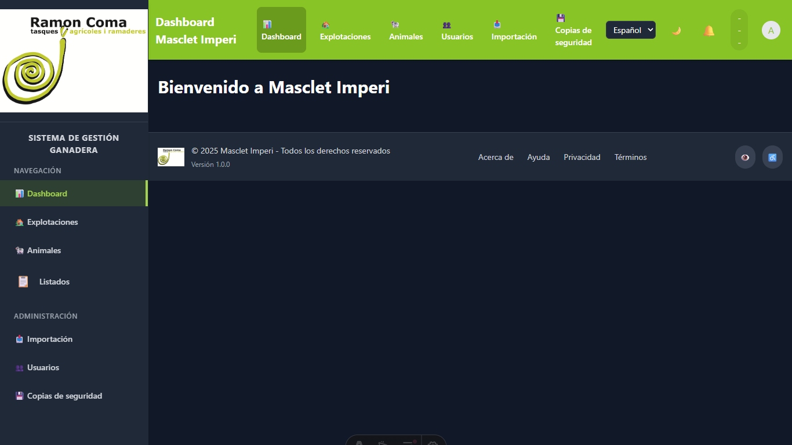
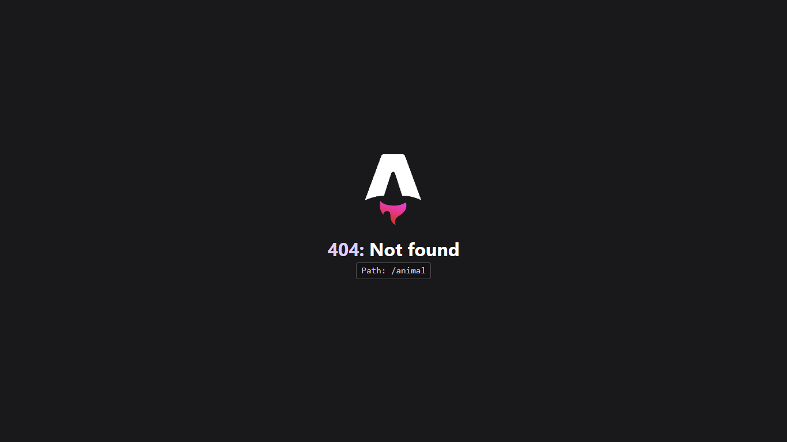
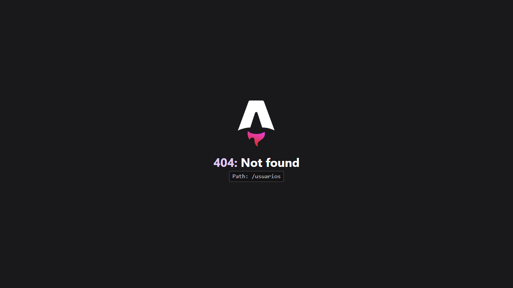

# Análisis de Estructura del Navegador

*Generado: 11/6/2025, 12:36:00*

## Ruta: /

**Título:** Panel de Control - Masclet Imperi



### Scripts (22)

```
http://172.20.160.1:3000/scripts/bloquear-eliminar-parto.js
http://172.20.160.1:3000/scripts/bloquear-editar-parto.js
http://172.20.160.1:3000/scripts/bloquear-actualizar-animal.js
http://172.20.160.1:3000/scripts/bloquear-acciones-listados.js
http://172.20.160.1:3000/src/pages/index.astro?astro&type=script&index=0&lang.ts
http://172.20.160.1:3000/src/pages/index.astro?astro&type=script&index=1&lang.ts
http://172.20.160.1:3000/src/components/layout/MainLayout.astro?astro&type=script&index=0&lang.ts
http://172.20.160.1:3000/src/components/layout/MainLayout.astro?astro&type=script&index=1&lang.ts
http://172.20.160.1:3000/src/components/layout/Navbar.astro?astro&type=script&index=0&lang.ts
http://172.20.160.1:3000/src/components/layout/Navbar.astro?astro&type=script&index=1&lang.ts
http://172.20.160.1:3000/src/components/LanguageSwitcher.astro?astro&type=script&index=0&lang.ts
http://172.20.160.1:3000/src/components/layout/Sidebar.astro?astro&type=script&index=0&lang.ts
http://172.20.160.1:3000/src/components/layout/Sidebar.astro?astro&type=script&index=1&lang.ts
http://172.20.160.1:3000/src/components/layout/Footer.astro?astro&type=script&index=0&lang.ts
http://172.20.160.1:3000/@vite/client
http://172.20.160.1:3000/@fs/C:/Proyectos/claude/masclet-imperi-web/frontend/node_modules/astro/dist/runtime/client/dev-toolbar/entrypoint.js?v=5e89932e
http://172.20.160.1:3000/node_modules/@astrojs/tailwind/base.css
http://172.20.160.1:3000/src/components/LanguageSwitcher.astro?astro&type=style&index=0&lang.css
http://172.20.160.1:3000/src/components/layout/Sidebar.astro?astro&type=style&index=0&lang.css
http://172.20.160.1:3000/src/components/layout/Footer.astro?astro&type=style&index=0&lang.css
http://172.20.160.1:3000/src/components/layout/MainLayout.astro?astro&type=style&index=0&lang.css
http://172.20.160.1:3000/scripts/permissions-ui.js
```

### Enlaces (30)

| Texto | URL |
|------|-----|
| 📊  Dashboard | http://172.20.160.1:3000/ |
| 🏡  Explotaciones | http://172.20.160.1:3000/explotaciones-react |
| 🐄  Animales | http://172.20.160.1:3000/animals |
| 📋 Listados | http://172.20.160.1:3000/listados |
| 📥  Importación | http://172.20.160.1:3000/imports |
| 👥  Usuarios | http://172.20.160.1:3000/users |
| 💾  Copias de seguridad | http://172.20.160.1:3000/backup |
| 📊  Dashboard | http://172.20.160.1:3000/ |
| 🏡  Explotaciones | http://172.20.160.1:3000/explotaciones-react |
| 🐄  Animales | http://172.20.160.1:3000/animals |
| 👥  Usuarios | http://172.20.160.1:3000/users |
| 📥  Importación | http://172.20.160.1:3000/imports |
| 💾  Copias de seguridad | http://172.20.160.1:3000/backup |
| Ver todas las alertas | http://172.20.160.1:3000/notifications |
| Mi Perfil | http://172.20.160.1:3000/profile |
| Configuración | http://172.20.160.1:3000/settings |
| Cerrar Sesión | http://172.20.160.1:3000/logout |
| Mi Perfil | http://172.20.160.1:3000/profile |
| Configuración | http://172.20.160.1:3000/settings |
| 📊  Dashboard | http://172.20.160.1:3000/ |
| 🏡  Explotaciones | http://172.20.160.1:3000/explotaciones-react |
| 🐄  Animales | http://172.20.160.1:3000/animals |
| 👥  Usuarios | http://172.20.160.1:3000/users |
| 📥  Importación | http://172.20.160.1:3000/imports |
| 💾  Copias de seguridad | http://172.20.160.1:3000/backup |
| Cerrar Sesión | http://172.20.160.1:3000/logout |
| Acerca de | http://172.20.160.1:3000/about |
| Ayuda | http://172.20.160.1:3000/help |
| Privacidad | http://172.20.160.1:3000/privacy |
| Términos | http://172.20.160.1:3000/terms |

### Llamadas API (4)

```
http://127.0.0.1:8000/api/v1/auth/login
http://127.0.0.1:8000/api/v1/dashboard/resumen-card
http://127.0.0.1:8000/api/v1/dashboard/stats
http://127.0.0.1:8000/api/v1/dashboard/partos
```

---

## Ruta: /explotaciones

**Título:** 404: Not Found


### Scripts (0)

*No se encontraron scripts externos*

### Enlaces (0)

*No se encontraron enlaces*

### Llamadas API (0)

*No se detectaron llamadas API*

---

## Ruta: /animal

**Título:** 404: Not Found



### Scripts (0)

*No se encontraron scripts externos*

### Enlaces (0)

*No se encontraron enlaces*

### Llamadas API (0)

*No se detectaron llamadas API*

---

## Ruta: /importar

**Título:** 404: Not Found


### Scripts (0)

*No se encontraron scripts externos*

### Enlaces (0)

*No se encontraron enlaces*

### Llamadas API (0)

*No se detectaron llamadas API*

---

## Ruta: /usuarios

**Título:** 404: Not Found



### Scripts (0)

*No se encontraron scripts externos*

### Enlaces (0)

*No se encontraron enlaces*

### Llamadas API (0)

*No se detectaron llamadas API*

---

## Ruta: /backup

**Título:** Login - Masclet Imperi | Masclet Imperi


### Scripts (6)

```
http://172.20.160.1:3000/src/pages/login.astro?astro&type=script&index=0&lang.ts
http://172.20.160.1:3000/@vite/client
http://172.20.160.1:3000/@fs/C:/Proyectos/claude/masclet-imperi-web/frontend/node_modules/astro/dist/runtime/client/dev-toolbar/entrypoint.js?v=5e89932e
http://172.20.160.1:3000/node_modules/@astrojs/tailwind/base.css
http://172.20.160.1:3000/src/styles/global.css
http://172.20.160.1:3000/src/styles/lemon-squeezy.css
```

### Enlaces (0)

*No se encontraron enlaces*

### Llamadas API (0)

*No se detectaron llamadas API*

---

